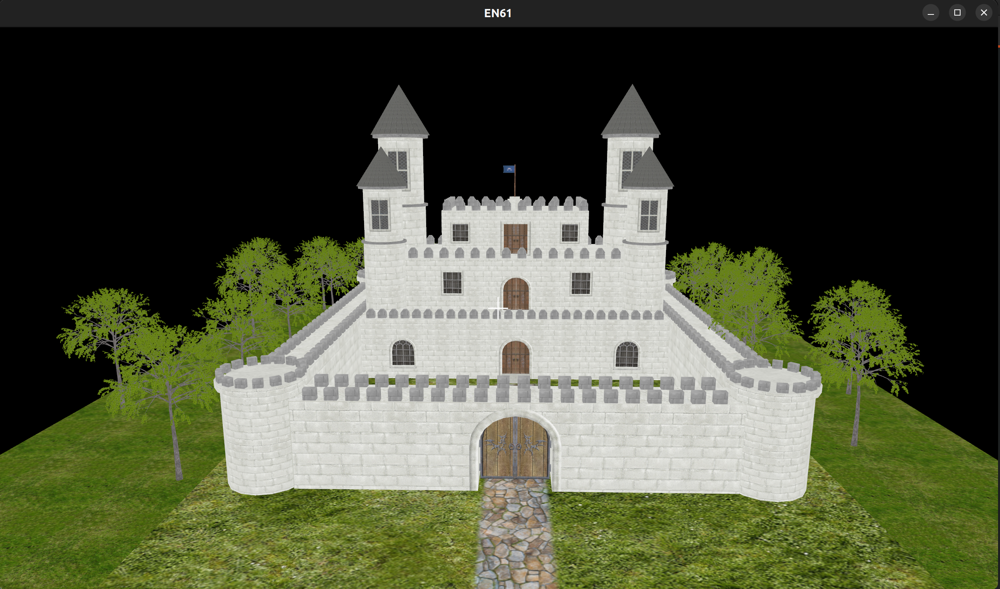

# EN61

A graphics engine written in c++.

# Screenshots
- Load 3D models of any common format

- Raycasting & Collision detection


# Compilation

* Download sources:
  ```bash
  git clone --recursive https://github.com/en61/en61.git
  cd en61/
  ```

* Compile library:
  ```bash
  mkdir build && cd build
  cmake .. && make
  ```

* Compile sandbox:
  ```bash
  cd sandbox/
  mkdir build && cd build
  cmake .. && make
  ./sandbox
  ```

# Used libraries
* [**assimp**](https://github.com/assimp/assimp)
* [**imgui**](https://github.com/ocornut/imgui)
* [**glfw3**](https://github.com/glfw/glfw)
* [**glad**](https://github.com/Dav1dde/glad)
* [**glm**](https://github.com/g-truc/glm)
* [**stb**](https://github.com/nothings/stb)
