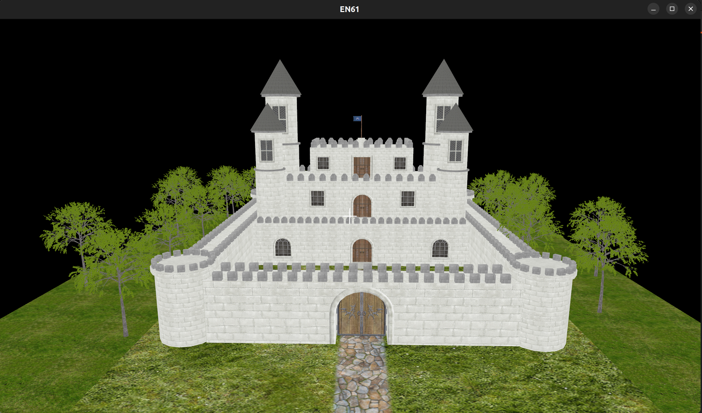

# EN61
> **A modular 3D graphics engine and sandbox framework built with Modern C++20 and OpenGL 4.3.**

EN61 is a real-time rendering framework engineered for modularity and high performance. It abstracts the complexities of the OpenGL pipeline, providing a clean architectural separation between the core engine logic and the sandbox environment. The project features a custom event-driven system, automated asset management, and a suite of spatial math utilities for interactive 3D applications.

## Table of Contents
1. [System Architecture](#system-architecture)
2. [Key Features](#key-features)
3. [Screenshots](#screenshots)
4. [Controls](#controls)
5. [Installation & Build](#installation--build)
6. [Third-Party Dependencies](#third-party-dependencies)
7. [Roadmap](#roadmap)

## System Architecture

The engine is built on a decoupled, layer-based design:

* **`core/base`**: Manages the application lifecycle, window orchestration (GLFW), and the main loop via a singleton `Application` class.
* **`core/renderer`**: A high-level abstraction of the OpenGL 4.3 pipeline, including custom `Shader`, `Mesh`, `Model` (Assimp-backed), and `Texture` wrappers.
* **`core/event`**: A custom dispatcher-based event system handling input and window events using modern C++ functional patterns.
* **`core/math`**: Optimized linear algebra and spatial logic, including **Raycasting** for mouse-to-world picking and **AABB Collision Detection**.
* **`core/world`**: Orchestrates scene entities and features a centralized `AssetManager` for efficient resource loading and caching.

## Key Features

### 1. Modern C++20 Design
* **Memory Management**: Robust ownership model using `Ref<T>` and `Scoped<T>` smart pointer aliases.
* **Efficient Data Views**: Utilization of `std::span` for non-owning, high-performance memory views in math and collision modules.
* **Template Metaprogramming**: Use of C++17 fold expressions and type traits for compile-time safety.

### 2. Advanced Rendering & Interaction
* **Universal Model Loading**: Leverages **Assimp** to process complex 3D assets (OBJ, FBX, GLTF) with automated material mapping.
* **Spatial Picking**: Custom ray-to-world conversion allowing for real-time object selection and interaction.
* **Integrated Tooling**: Embedded **ImGui** suite for real-time parameter tweaking and engine debugging.

### 3. Developer Workflow
* **Decoupled Sandbox**: A dedicated `sandbox/` environment that links against the core engine as a library, ensuring a clean separation of concerns.

---

## Screenshots

### Real-time Asset Rendering
Capable of handling complex geometry with automated material and texture mapping.


### Interaction & Debugging
Real-time raycasting, collision detection, and primitive manipulation via the UI.


---

## Controls
* **W, A, S, D**: Movement
* **Mouse Movement**: Look around
* **Right Click**: Place selected object (Block, Tree, etc.)
* **ESC**: Toggle Sandbox Menu / Unlock Mouse

---

## 🛠 Compilation & Build System

The project uses **CMake** with a recursive strategy for managing internal dependencies.

### Prerequisites
* C++20 compatible compiler (GCC 10+, Clang 10+, MSVC 19.29+)
* CMake 3.9+

### Installation & Build
```bash
# Clone the repository and initialize submodules
git clone --recursive https://github.com/en61/en61.git
cd en61/

# Build the Core Engine Library
mkdir build && cd build
cmake ..
make -j$(nproc)

# Build and run the Sandbox Demo
cd ../sandbox
mkdir build && cd build
cmake ..
make
./sandbox
```
---

## Third-Party Dependencies
* **OpenGL 4.3** (Graphics API)
* **Assimp** (3D Model Loading)
* **ImGui** (User Interface)
* **GLFW3 / GLAD** (Windowing and GL Loading)
* **GLM** (Mathematics)
* **stb** (Image Processing)

---

## Roadmap
- [ ] **Material System Abstraction**: Implementing formal GLSL uniform management.
- [ ] **Advanced Lighting**: Transitioning to a multi-source Blinn-Phong or PBR workflow.
- [ ] **Scene Graph**: Hierarchical node system for complex object transformations.
